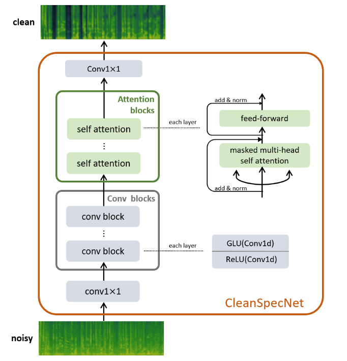

# Pytorch Implementation of CleanSpecNet

This repo contains non-official PyTorch implementation of CleanSpecNet, present in the model architecture CleanUNet2: [CleanUNet 2: A Hybrid Speech Denoising Model on Waveform and Spectrogram](https://arxiv.org/abs/2309.05975). CleanUNet2 is a spectrogram-based sub-module, which use convolution layers and self-attention block.  The model is optimized
through a customized loss defined over spectrogram. 




## Datasets

This code is adapted to use any dataset containing clean audios, and during training data augmentation is applied to create a version with noises. Therefore, just create the .csv file and include it in the config.json. As an example, there is a version using the [LJSpeech-1.1](https://keithito.com/LJ-Speech-Dataset/) dataset. The transcripts are not required. The filelists can be found at:

```
filelists/ljs_audio_text_train_filelist.txt
filelists/ljs_audio_text_test_filelist.txt
filelists/ljs_audio_text_val_filelist.txt
```

In `config.json`, just include the path to the csv files:

```
"trainset_config": {
    "data_dir": "../DATASETS/LJSpeech-1.1/wavs",
    "train_metadata": "./filelists/ljs_audio_text_train_filelist.txt",
    "test_metadata": "./filelists/ljs_audio_text_val_filelist.txt",
```

For data augmentation, a basic configuration is already included in `config.json`:

```
        "augmentations": [
            {
                "name": "Mp3Compression",
                "params": {
                    "min_bitrate": 128,
                    "max_bitrate": 192,
                    "backend": "pydub",
                    "p": 0.2
                }
            },
            {
                "name": "AddBackgroundNoise",
                "params": {
                    "sounds_path": "./noises_path/",
                    "min_snr_in_db": 15.0,
                    "max_snr_in_db": 30.0,
                    "p": 0.2
                }
            },  
            {
                "name": "AddGaussianSNR",
                "params": {
                    "min_snr_in_db": 15,
                    "max_snr_in_db": 30,
                    "p": 0.2
                }
            },
            {
                "name": "LowPassFilter",
                "params": {
                    "min_cutoff_freq": 4000,
                    "max_cutoff_freq": 7000,
                    "p": 0.2
                }
            },
            {
                "name": "HighPassFilter",
                "params": {
                    "min_cutoff_freq": 400,
                    "max_cutoff_freq": 2000,
                    "p": 0.2
                }
            },
            {
                "name": "ApplyImpulseResponse",
                "params": {
                    "ir_path": "/path/to/sound_folder",
                    "p": 0.2
                }
            }            
        ]  
```

Check out the repository (room-impulse-responses)[https://github.com/RoyJames/room-impulse-responses] to download datasets for Room Impulse Responses

## Training

The ```$EXP``` variable can be any config name in ```./configs/```, such as ```config.json```. The default experiment path is salved at ```./logs_training/cleanspecnet```; it can be changed by modifying ```train_config[log[directory]]``` in the config files. ```trainset_config[root]``` needs to be set as the root path of the dataset. Then, the training code is

```python3 train.py -c configs/config.json```


## Fine Tuning

To perform finetuning, you can include the path to the checkpoint in config.json:

```
"checkpoint_path": "./checkpoints/pretrained.pkl",
```

and run the training:

```python train.py -c configs/config.json```

## Citation

```
@inproceedings{Kong_2023, series={interspeech_2023},
   title={CleanUNet 2: A Hybrid Speech Denoising Model on Waveform and Spectrogram},
   url={http://dx.doi.org/10.21437/Interspeech.2023-1287},
   DOI={10.21437/interspeech.2023-1287},
   booktitle={INTERSPEECH 2023},
   publisher={ISCA},
   author={Kong, Zhifeng and Ping, Wei and Dantrey, Ambrish and Catanzaro, Bryan},
   year={2023},
   month=aug, pages={790–794},
   collection={interspeech_2023} }
```
